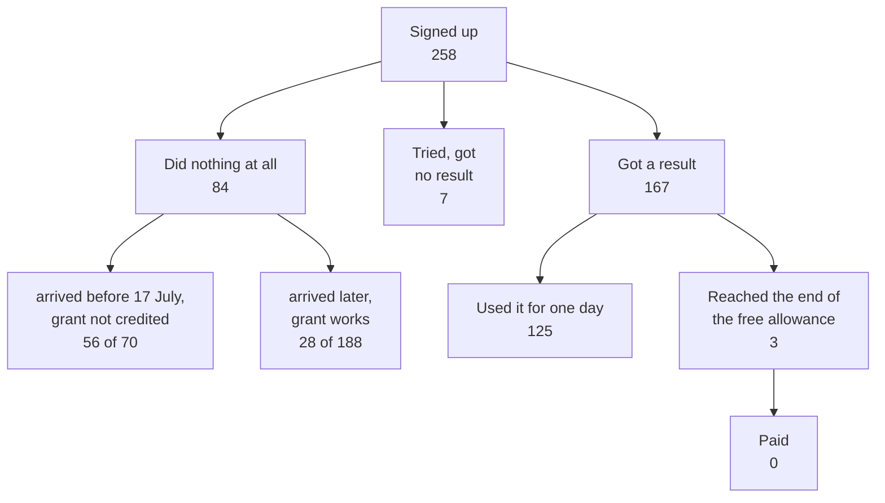

import { Image } from 'astro:assets';
import otterPricing from '../../../assets/screenshots/otter-pricing-90min.png';

## What we are solving

You want to push a side project, you open a niche — and somebody is already working there, usually more than one somebody.

That is normal. Somebody took the niche, and that does not mean they did it well, because people rarely do it well.

Almost anyone can put a product together now, because writing the code got cheap. Two other things got hard: people have to find you, and you have to explain how you are better.

That explanation is what people skip: they sit down to build features without answering the question. Below I show on my own numbers what that cost me.

## Steps

### What counts as a pet project, and whether it may take money

A pet project is what you build outside your job and outside somebody else's plan, so you decide what to do. That does not mean you may not take money.

Money spoils nothing. If anything, the reverse. People use free things happily, and that tells you nothing, while one person who pays says more about the product than a hundred who signed up.

So think about money right away, not at the end. What exactly to charge for — an action or a month — I cover separately: [the pricing model](/money/pricing-model/).

### There will be no empty niche, and emptiness is the wrong thing to look for

An empty niche usually has one of two causes: either nobody has the job, or the job exists and nobody pays for it. Check that first — [whether this audience pays for anything](/demand/will-they-pay/).

And if somebody is working in the niche, the demand is already there, and somebody before you proved the job is real and that money changes hands over it.

From there it is simple. Every working competitor has at least one thing done badly, and it irritates the people who pay him, too.

A paying customer is the most patient person of all, because he spent money and does not want to admit it was wasted. If he still sat down to write a review, something really got to him.

Start there. Do not ask what the market is missing — ask what the market has that grates.

> In the real world outside economic theory, every business is successful exactly to the extent that it does something others cannot.
>
> — Peter Thiel, "Competition Is for Losers", The Wall Street Journal, 12 September 2014. He writes the same thing in chapter three of Zero to One.

And a second quote, about where ideas come from.

> When something annoys you, it could be because you're living in the future.
>
> — Paul Graham, "How to Get Startup Ideas", November 2012. For him annoyance is a hint, not a nuisance.

### Where that anger is already written down in plain words

You do not have to run interviews: people have written it all down themselves, for free and with dates.

**The App Store hands over its reviews in one command, with no account.** First you find the app id, then you read the feed:

```bash
curl -s 'https://itunes.apple.com/search?term=otter&entity=software&country=us&limit=3'
curl -s 'https://itunes.apple.com/us/rss/customerreviews/page=1/id=1276437113/sortby=mostrecent/json'
```

Fifty reviews to a page, around nine pages, then nothing. Every review carries a date, a rating and the app version, and the version says which release the complaints started on. Change the country right in the address: `gb`, `fr` and `de` complain about different things.

Here is what I found there. Otter on the paid Pro plan cuts a recording off at 90 minutes, and that is not a fault: it is written in their price list. Four hours only come one tier up.

<figure>
  <Image
    src={otterPricing}
    alt="Otter.ai pricing page, four plans side by side. Basic is Free for those who want to give it a try, and lists 300 monthly transcription minutes. Pro is $8.33 per user per month with a save 51 percent badge, lists 1200 in-app recording minutes, and under Everything in Basic, plus the first line reads Up to 90 mins per meeting. Business is $19.99 per user per month, marked Best Value, lists unlimited meetings and in-app recordings, and under Everything in Pro, plus the first line reads Up to 4 hours per meeting. Enterprise offers a demo."
  />
  <figcaption>
    Otter pricing, read on 13 August 2026. The prices are annual. Ninety minutes is a line in the price list, not a bug. The two reviews below were written by people who left because of it.
  </figcaption>
</figure>

On 2 August 2026 a person on the $99.99-a-year subscription gives one star.

> Paywalled out of seeing the last 19 minutes of an enthralling conversation.

A week before that, on 25 July, two stars from somebody else.

> after several years of satisfying service, I am now forced me to move on to other providers

Both were paying. Both left. And one line in a price list stopped them both — that is the kind of thing you are looking for.

**Count them, do not scroll them.** I downloaded that app's whole feed, and it came to 209 one- and two-star reviews, from 16 September 2024 to 3 August 2026. Money and limits: 118 reviews. The bot mixing up who is speaking: 11.

And I had been sure the main pain here was "which of them is talking now". Among paying users that pain loses to money ten to one, and I could have found this out in ten minutes.

**Forums give you links that will not rot.** An App Store review has no permanent address: new reviews arrive and it moves to another page. So quote Discourse forums instead: every thread there has its own URL, and it will outlive your article.

```bash
curl -s 'https://community.openai.com/search.json?q=transcription+empty'
curl -s 'https://hn.algolia.com/api/v1/search_by_date?query=%22otter.ai%22&tags=comment'
```

Both work without a key and without an account. Checked on 13 August 2026.

**And this part stopped being free.** The advice about it is usually out of date. Reddit no longer reads from a script: without OAuth the feed returns 403. Search on X is prepaid. G2 and Capterra banned headless browsers in their 2026 terms — by hand is fine, automated is not.

### What "features first" actually costs

Now my numbers. And my own mistake in how I read them.

Between 12 May and 15 August, 258 people signed up to the bot. Here is what became of them.



**84 people did nothing at all** — not one row in the events table. For three months I read that as "there is no demand", and then I split it by date.

Before 17 July the starting grant was not credited, so people arrived with zero credits and could do nothing. That was my bug, not the market: 56 of 70 left that way, against 28 of 188 afterwards.

And the other half of the same story. The feedback button sat in the bot the whole time, in three months nine people used it, and nobody wrote to say the product did not work.

So silence in your data is not a verdict on demand — check first whether the product was even working, because a broken product and an indifferent audience look exactly the same from here.

Now the people it did work for. 167 got a result at least once, and **125 of them used it for one day**.

Three users reached the end of the free allowance. One tried again, nobody paid, and the lowest balance is 16 credits against an average of 209.

So you have to survive as far as the freemium wall, and almost none of mine did. Features would not have helped here. Fixing the grant two months earlier would have.

### How to name the difference in one line

Say something about yourself that a competitor cannot repeat until he rebuilds himself.

"Easier" and "faster" do not count. Everybody says that about themselves, and nobody can check it. A good sentence names a specific irritation and the specific people it gets to.

Say it out loud before the first line of code. If it will not come out, you have no difference yet, and finding that out now is a great deal cheaper than finding it out at your three hundredth user.

## What did not work

- **Looking for an empty niche.** Empty almost always means nobody pays for the job. Look for money, not for the absence of competitors.
- **Reading silence as an absence of demand.** 84 people out of 258 pressed nothing. For three months I took that as a verdict on the niche. For 56 of them it was my bug: zero credits.
- **Waiting for people to hit the free limit.** I built the economics around a wall that three people reached. They left earlier than that, and quietly.
- **Believing somebody would report the breakage.** The feedback button sat in plain sight. Nine messages in three months, and not one about the grant.
- **Reading a competitor's average rating.** The average is the output of marketing. Everything useful sits in the one- and two-star reviews.
- **Treating a signup as a signal.** The signups looked like an audience. Of the people the product actually worked for, 125 came exactly once.
- **Waiting for the difference to occur to me along the way.** It did not. Either the difference exists before the code, or it gets written into the description afterwards and convinces nobody.

## Verify

- Name out loud one live competitor and one thing he does badly. If a second thing will not come, you have not started looking.
- Find the same complaint from three different people, in three different places, with dates. One complaint is one person, not a market.
- Check that at least one of them pays. A free user's complaint is worth less: he risked nothing.
- State the difference in one sentence without the words "easier" and "faster". If your competitor can repeat it word for word, it is not a difference.
- Look at how many of your users took no action at all. If you do not have that number, [the event row is not carrying it](/analytics/product-metrics/).

You know what you are building and how you differ. The next question is which market to build it for: [which market to build for](/demand/pick-a-market/).
