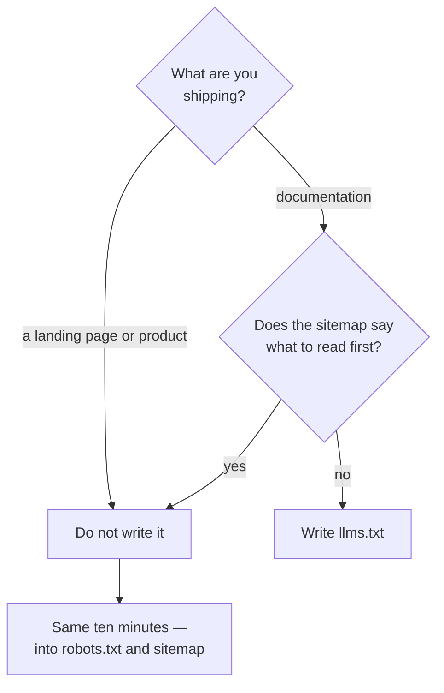

## What we are solving

You decide who is allowed to read the site. On most projects that decision gets made by accident, in a panel nobody opened. And if a crawler never reaches you, you are not in the AI answer, so how good the page is stops mattering after that.

The trap sits in the phrase "AI bot": three different jobs hide behind those two words, and saying no to each of them costs you a different amount.

## Steps

Sort the agents by job first, and decide afterwards. A search crawler, a training crawler and a fetcher acting for a user are three separate calls.

| User agent | Owner | Job | What a block costs |
|---|---|---|---|
| `OAI-SearchBot` | OpenAI | Search index | You are gone from ChatGPT search results |
| `ChatGPT-User` | OpenAI | Fetch on user request | Little — OpenAI documents that robots.txt may not apply to it |
| `GPTBot` | OpenAI | Training corpus | Nothing in today's answers |
| `Claude-SearchBot` | Anthropic | Search index | You are gone from Claude's web results |
| `Claude-User` | Anthropic | Fetch on user request | A URL your reader pastes will not open in the chat |
| `ClaudeBot` | Anthropic | Training corpus | Nothing in today's answers |
| `PerplexityBot` | Perplexity | Search index | You are gone from the engine with the clearest attribution |
| `Perplexity-User` | Perplexity | Fetch on user request | Little — Perplexity documents that it generally ignores robots.txt |
| `Google-Extended` | Google | Control token | Out of Gemini training and Vertex AI grounding |
| `GoogleOther` | Google | Assorted internal fetches | Little in AI answers |
| `CCBot` | Common Crawl | Open corpus for training | Nothing in today's answers |

### What goes in robots.txt when you want nothing unusual

Four lines, and on most projects the file ends there.

```text
User-agent: *
Allow: /

Sitemap: https://example.com/sitemap-index.xml
```

That is what this site serves. I name an agent only when I want to block it. A list of agents allowed by name is a list somebody then has to maintain, and vendors ship new names faster than anyone goes back to re-read the file.

Read what the live domain serves, not what sits in your repository, because a CDN can rewrite this file on the way out.

```bash
curl -sS https://example.com/robots.txt
```

Cloudflare's managed version sits on the zone's **Security Settings** page, under the **Bot traffic** filter. It is on every plan. Turn it on and it prepends its own `Disallow` lines above yours, while a Free-plan domain with no file of its own gets Cloudflare's Content Signals Policy instead.

Search agents, and agents a person triggered, decide whether you exist in an answer today. The training group is a values call. That is the only case where I would type a name at all.

### Which of your rules actually bind anybody

A crawler honours `robots.txt`. A fetcher does not always. The gap between them is wide enough to ruin a diagnosis.

OpenAI writes that because the action is initiated by a user, robots.txt rules may not apply, and Perplexity says its user agent generally ignores the file for the same reason. Anthropic is the exception. It says its bots honour the file.

So the same `Disallow` line behaves three different ways at three vendors. Nothing in your file will tell you that. Only the vendor's documentation does.

### Google-Extended switches off something else

It is a control token. It has no user agent of its own, so you will never see it in a log. It carries no ranking signal. What it covers is training of the Gemini models and Grounding with Google Search on Vertex AI.

Blocking it changes nothing in Google Search. AI Overviews is part of Search, and plain `Googlebot` does the crawling for it.

### Getting out of AI Overviews for real

There is a dedicated control, in Search Console under Settings → Search generative AI. It covers AI Overviews, AI Mode and the generative features in Discover, and Google states it is not used as a ranking signal elsewhere in Search.

`nosnippet`, `data-nosnippet` and `max-snippet` keep you out too. They also take your ordinary Search snippet with them. The dedicated control does not charge that, but it is rolling out to a subset of owners, so it may not be in your property yet.

### If you do name agents, the order of the groups decides

RFC 9309 says a crawler obeys one group, the one whose name matches it best, so a generous `User-agent: *` further down does not rescue an agent you blocked above it.

The rule cuts both ways. Here is the half that bites: one stale group silently overrides the wildcard under it. That is why I keep no per-agent allow list at all.

### Where the block actually lives

Three layers sit under `robots.txt`: the `X-Robots-Tag` header, the meta tag, and the edge. The file shows none of them, and a CDN toggle, a WAF rule or a rate limit answers 403 while you go on editing a file that nobody is reading. A WAF is a firewall that matches HTTP requests.

On Cloudflare the control is called **Configure AI bot policies**, on the zone's **Security Settings** page. It is on every plan, Free included. It sorts agents into Search, Agent and Training, and each group takes Allow, Block on all pages, or Block only on pages with ads.

Which agents land in each group is Cloudflare's own list. That list changes without you. Block is terminating. Cloudflare answers 403 from its own network and your server never sees the request.

From 15 September 2026 a domain new to Cloudflare arrives with Training and Agent blocked on ad-bearing pages, and the older single switch beside it, **Block AI bots**, retires the same day. Existing zones keep their settings. You can opt out of the new defaults until 15 September.

The same panel can charge instead of refusing: pay per crawl answers 402, and it is in closed beta.

### A name in the log is a claim, not an identity

Anyone can send a user agent string. I sent myself a pile of them. A `curl` loop of mine put vendor names into my own access log, and for two weeks I read those lines back as visits. Vendors publish IP ranges and reverse DNS for their crawlers, so check a client against those before you treat its line as evidence of a visit or of an attack. What that cost me is written out in [who actually crawls you](/geo/who-actually-crawls-you/).

### Is llms.txt worth writing

The short answer turns on one thing: do you have documentation where an agent would struggle to find the right page on its own.



So `llms.txt` solves exactly one problem: saying in words which of your pages to read first. If you have five pages and they are already in plain sight, there is no problem to solve.

The file costs ten minutes. No vendor commits to reading it, and here is what mine got in 16 days:

| Who fetched `llms.txt` | Requests |
|---|---|
| my own `curl` | 44 |
| `SiteAuditBot` (Semrush) | 1 |
| AI agents | 0 |
| **total** | **45** |

For comparison: `robots.txt` was fetched 56 times in the same window. Those were real crawlers.

Two caveats, without which that zero cannot be read. The window has a hole: logrotate keeps 14 daily archives, so 20 to 28 July did not survive. And a request the edge refuses never reaches nginx, so it never appears in the table above at all, and you cannot see that from the server side. So I went and read both sides for one day:

| | Cloudflare | nginx |
|---|---|---|
| Requests | 668 | 672 |
| 200 | 651 | 648 |
| 404 | 13 | 13 |
| **403** | **0** | **0** |

The counts agree. There is not one 403 on either side, so my edge refuses nobody. The four-request gap is my nginx window running an hour wider, and Cloudflare's free plan hands out this dataset a day at a time, so I could not match the windows exactly.

That is the check to run. If the edge were refusing anyone, Cloudflare's counter would sit well above the server's, and that gap would be your answer. The full read is in [who actually crawls you](/geo/who-actually-crawls-you/).

So on a small marketing site you are betting ten minutes against a measured payoff of 0, while on forty pages of docs the bet is a reasonable one. Anywhere else I would rather spend the ten minutes on `robots.txt` and the sitemap. Every agent does read those.

The format itself is short: an H1 on the first line, a one-sentence blockquote under it, absolute links, and a description after every colon. `robots.txt` says which paths to stay out of. `llms.txt` says what is worth reading, in your own words.

```markdown
# Project name

> One sentence about what this is and who it is for.

## Docs

- [Page title](https://example.com/page): what it covers and when it helps.

## Optional

- [Secondary page](https://example.com/extra): safe to skip under a tight context budget.
```

### Who actually came, which only the log will tell you

Support for `llms.txt` is a convention, not a standard anyone enforces, so the only honest answer about your own visitors lives in the access log.

```bash
zcat -f /var/log/nginx/example.access.log* \
  | grep -icE 'chatgpt-user|oai-searchbot|gptbot|perplexity|claude-user|claudebot|meta-externalagent'
```

My own log is counted out in [who actually crawls you](/geo/who-actually-crawls-you/). The same page holds the limit of this method: a request the edge blocked never reaches your server. It never becomes a line here. Grep for an agent Cloudflare is refusing and you get nothing back, so the log reads as though nobody came at all.

Those requests are counted on the other side of the block: Cloudflare counts them under **AI Crawl Control**, in the **Crawlers** and **Metrics** tabs. The block itself lands under **Analytics** → **Events**, and Free plans keep 24 hours of it.

## What did not work

- **Blocking everything to save bandwidth**. The block sat at the edge, in the CDN's own AI-bot setting, and not in `robots.txt` where I kept looking for it. Agent is one of the three behaviours those settings cover, so it stopped the fetchers as well. A reader who pasted the URL into a chat was told the page could not be opened.
- **Losing the citation along with the bill**. The busiest AI agent in my log took 341 requests in 16 days — [who actually crawls you](/geo/who-actually-crawls-you/). It is `ChatGPT-User`, and a human has to trigger it. I cannot prove the human was not me. Turning that traffic off is easy. Getting back into the answer is not.
- **Making `llms.txt` a required item**. This page told you to publish it, and the route repeated the instruction. Then my own log recorded 0 fetches by any AI agent in 16 days. I stopped calling it a required step. The condition now is one thing: you ship developer docs.
- **Allowing agents by name in `robots.txt`**. The route asked readers to list every search agent and every fetcher by name. This site has never done that: it serves `User-agent: *` and `Allow: /`. A named list expires, and keeping it current falls on you. RFC 9309 also lets a stale group override the wildcard under it.
- **Disallowing `Google-Extended` to get out of AI Overviews**. It is a line in `robots.txt` and it governs something else entirely. It governs training of the Gemini models, and whether Gemini pulls your pages into an answer of its own. Plain `Googlebot` crawls for AI Overviews, so my rule changed nothing. The switch I wanted was in Search Console, under Settings → Search generative AI.
- **Steering AI Overviews with `nosnippet`**. That was the advice on this page until 3 June 2026, when Google shipped the dedicated Search Console control. The snippet directives also cost you the ordinary Search snippet. The dedicated control does not charge that.
- **Trusting a vendor page that had stopped moving**. Google's own `ai-features` documentation still lists only the snippet directives, and it was last updated 2025-12-10. My page was faithfully reproducing a source, and the source had gone stale.
- **Writing `Disallow` for `ChatGPT-User` and calling it a block**. OpenAI documents that a user-initiated fetch may ignore robots.txt. Perplexity says the same about its own. I was politely asking a client whose vendor had already told it not to bother listening.
- **Editing `robots.txt` while the edge did the blocking**. The file allowed every agent by name. The bot-protection rule in front of it returned 403. The log showed no successful fetches at all. That rule is invisible in `robots.txt`, in the page source and in the server log. It shows up only in the CDN's own security events.
- **Listing outlines in `llms.txt`**. A line in that file is a promise that the page behind it is written. A link to a page you never wrote teaches the reader to ignore the whole file. Human or model, both learn it.
- **Treating `robots.txt` as enforcement**. It is a request. A well-behaved crawler honours it. A scraper ignores it, and then only the edge stops it — or nothing does.

## Verify

Run `geo-crawlers` from [Tools](/tools/). It reads `robots.txt`, the meta tags and the response headers, and gives back an access map per agent. That is how you catch a rule you forgot you wrote.

Run `geo-llmstxt` from the same place. It validates an existing file or drafts one from the site structure, and it flags links that lead nowhere.

Then check from outside:

- Find out what sits in front of your origin at all.

  ```bash
  curl -sI https://example.com | grep -iE '^(server|via|cf-ray):'
  ```

  A `cf-ray` header means Cloudflare. Vercel, Netlify and Fastly announce themselves the same way. If nothing is in front, only your firewall and your web server can refuse a crawler. The checks below then move there.
- On Cloudflare, open **Security Settings** and read what **Configure AI bot policies** is set to. A default you never chose is still your setting.
- On Cloudflare, open **Analytics** → **Events** and filter the action to Block. Agents refused there appear in no log on your own box. Other platforms keep their own edge or firewall log. If yours has none, the request either reached your server or vanished where you cannot see it.
- Request a page as a crawler, from a network that is not yours, and check for 200.

  ```bash
  curl -s -o /dev/null -w '%{http_code}\n' -A 'OAI-SearchBot' https://example.com/
  ```
- If you published `llms.txt`, fetch it the same way and confirm every link in it returns 200.
- Ask an assistant to open one of your URLs. If it cannot, the block is real. The checks above tell you which layer holds it.
- Write down the minute you did that. It lands in your log as `ChatGPT-User` or `Claude-User`, from the vendor's address. You cannot tell it apart from a stranger's visit.

Access is only the gate. What gets quoted once you are through it is a separate problem: [why AI answers cite someone else](/geo/citable-pages/).
