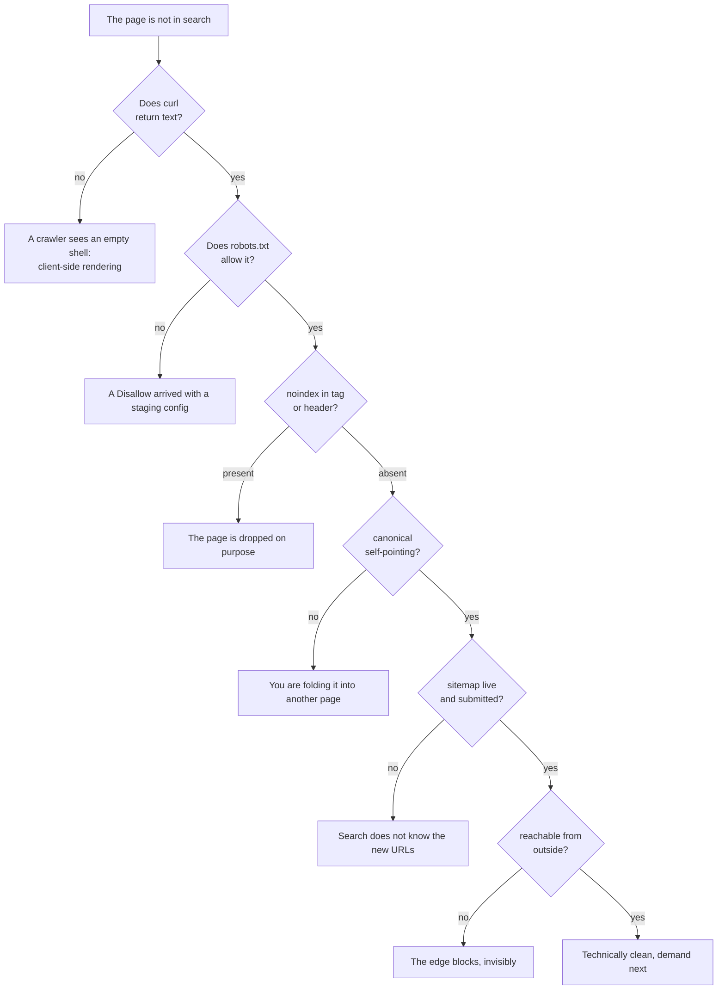

## What we are solving

The site has been live for weeks and search returns nothing for it. Not a weak position — no result at all.

Indexing fails from the top down. First a crawler has to fetch the page, then crawl it, then index it, and only after all of that can the page rank.

A rewritten `title` on a `noindex` page changes nothing. So the checks below run in order: stop at the first one that fails, because while the page is blocked you cannot measure anything else on it.



## Steps

### Does the crawler get any text at all

The first thing I check is what the server hands over before any JavaScript runs. Fetch the page and look for a sentence you can read on it with your own eyes:

```
curl -sL https://example.com/page | grep -i "a sentence you can see on the page"
```

If grep says nothing and the browser shows the text, the browser is drawing it: such an app answers with a near-empty `<body>`, and the crawler gets a page with nothing to index. You fix that with server rendering or a prerender step at build time. A tag will not fix it.

### What is actually in your robots.txt

Pull the file from the live domain and read all of it — not from memory, and not only the lines you wrote yourself:

```
curl -s https://example.com/robots.txt
```

The classic one is a `Disallow: /` that rode in from a staging config with the deploy. Another failure is quieter: Google stops reading the file past 500 kibibytes, a generated robots can truncate silently somewhere in the middle, and everything below the cut does not exist for Google.

### Are you asking search to drop the page yourself

`noindex` lives in two places. The meta tag sits in the HTML, where you can see it in View Source, and the `X-Robots-Tag` response header never shows up there at all:

```
curl -sI https://example.com/page | grep -i x-robots-tag
```

`curl -sI` sends a HEAD request and prints the headers alone, and in a browser the same thing is under Network, the document request, Response Headers.

That header can come from the framework, the web server or the CDN. Those are three different files, and you will have to open each one. There is also a per-agent form — `X-Robots-Tag: googlebot: noindex` — and it looks like an ordinary line of config, so the eye slides right past it.

Search fetches a `noindex` page and reads it honestly enough. Then it drops the page on purpose.

### How many addresses the page has, and where it points

Every page should carry a canonical pointing at itself or at the real original:

```
curl -sL https://example.com/page | grep -i 'rel="canonical"'
```

Some templates hardcode the home page as the canonical across every page, and that way you are asking search to discard the rest of the site yourself.

Then count how many different addresses answer with the same page: trailing slash, `www`, `http`, `index.html`, tracking parameters — all of them have to redirect to a single form:

```
for u in http://example.com/page https://www.example.com/page https://example.com/page/ https://example.com/page/index.html; do
  curl -o /dev/null -sw "%{http_code} %{redirect_url}\n" "$u"
done
```

Otherwise the signal splits between duplicates and the sitemap starts disagreeing with the canonical tag. Search settles that argument on its own, without you.

### Is the sitemap alive, or merely present

Do not check that the file exists. Check that every URL in it answers 200 and that each one is written out in full, in the canonical form:

```
curl -s https://example.com/sitemap.xml | grep -o '<loc>[^<]*' | cut -c6- |
  while read -r url; do curl -o /dev/null -sw "%{http_code} $url\n" "$url"; done
```

The protocol caps one file at 50,000 URLs and 50MB uncompressed. Past that, split the file and add a sitemap index, and if a map is stuffed with redirects and 404s, it stops being read as the truth about the site.

### Is the site visible from outside your network

Do not run the last check from your own machine. Resolve the domain from someone else's address and request the page without cookies:

```
ssh other-box 'curl -sI https://example.com/page'
```

Access control, basic auth and edge bot rules answer with a login page or a 403. None of that is visible in `robots.txt`.

The edge rule has a name and a screen it lives on: on Cloudflare it is **Configure AI bot policies**, on the zone's **Security Settings** page, on every plan. Cloudflare refuses a matching agent with a 403 from its own network, and that request never reaches your server.

So the refusal is not in your server log either: you can see it only in Cloudflare's **Analytics** → **Events**. The whole mechanism is on [AI crawlers and llms.txt](/geo/llms-txt-and-crawlers/).

## What did not work

- **Waiting for the index to catch up**. The crawler does come back, reads the same rule and leaves again. Patience does not edit a header.
- **Re-submitting one URL in the inspection tool**. The re-fetch uses the same `robots.txt`, the same header, the same empty body. The verdict comes back identical. The daily quota is gone.
- **Trusting a third-party crawler as proof of access**. The report says what someone else's bot could fetch from its own address, and whether search decided to keep the page is a different question.
- **Checking only from my own laptop**. I had a logged-in session, a warm service worker and a home network the edge already trusts, and together they hid the failure completely. The edge is the CDN sitting in front of your origin: Cloudflare, Fastly, a cloud load balancer. It answers some requests itself, and those never reach your server.
- **Editing `robots.txt` when the block lived at the edge**. Bot-protection and WAF rules are invisible in that file, and the file was clean the whole time. Look for Cloudflare's **Configure AI bot policies** under **Security Settings**, and any WAF custom rule beside it — this is the most common hidden blocker I run into.
- **Rewriting titles and descriptions first**. On a page that is not in the index, on-page work produces nothing you can measure.

## Verify

Run the `seo-audit` skill from [Tools](/tools/): it walks this same order and collects the answers into one report, and doing the same by hand takes longer.

Then check by hand what the report cannot fake:

- `curl -sI` on the page returns 200 and carries no `X-Robots-Tag`.
- `curl -sL` on the same URL contains a sentence you can read on the page.
- URL Inspection in Search Console says the URL is on Google.
- Cloudflare's **Analytics** → **Events**, filtered to the Block action, holds nothing for your own URLs, because a blocked crawler shows there and nowhere on your server.

To see roughly how many pages reached the index at all, ask the search box:

```
site:example.com
```

Read the wording in Search Console literally. "Discovered — currently not indexed" means the URL is known and was not fetched, while "Crawled — currently not indexed" means it was fetched and judged not worth keeping. Those are two different bugs, and you fix them differently.

Once one page is in, hand over the rest: [submit and verify](/indexing/submit-and-verify/).
