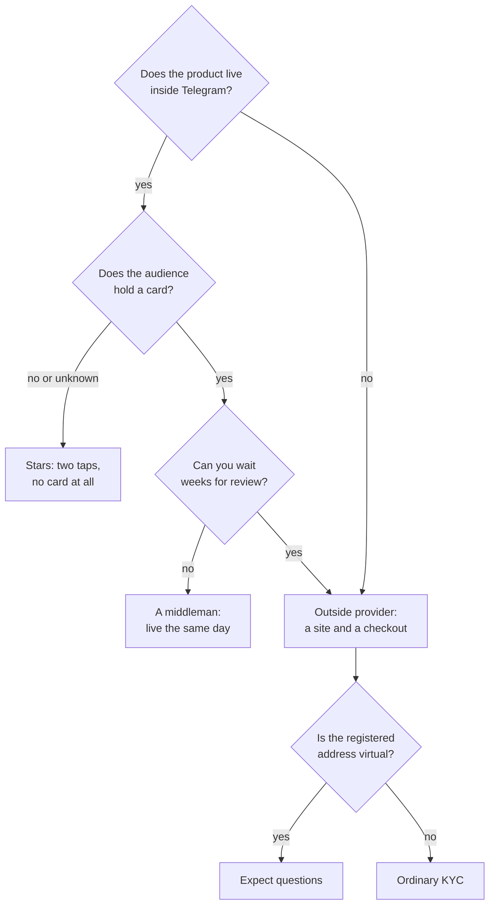

## What we are solving

You have a price and nothing to take it with. Picking a rail looks like picking a fee, and in a comparison table that is all it is.

Two things decide it that the table does not hold. Whether they let you in at all, and what happens between "they paid" and "they got what they bought".

The fee is the cheapest part of it. Mine was settled by which half of the audience owns a foreign card, and by the weeks a provider spent working out what I am.

## Steps

### What the three rails cost

| | Stars | Tribute | Paddle |
|---|---|---|---|
| Fee | no published rate | 10% of a transaction | 5% + $0.50 per checkout |
| Paid where | inside Telegram | an outside link | your own site |
| Card | none needed | Russian | foreign |
| Money out | through Fragment | roubles and euros | USD, EUR, GBP |

Stars have no percentage because Telegram does not print one. Two documented numbers stand in for it: a developer receives **0.013 USD of reward per Star**, while the same Star spent on Telegram advertising is worth **0.02 USD**. The gap is what taking the money out costs. Nobody states it as a rate.

Two clocks sit in the same document and never reach a fee table. Stars take **up to 21 days** to become available. They expire after three years.

### Whether they let you in is a separate question, and a dearer one

The fee is visible immediately. The review is not. Mine at Paddle ran three months: application, a cancelled call, a hand-off to self-serve, risk review, then identity checks through an outside service.

The step that would not pass was **proof of address**, and it came back rejected on three grounds at once.

A virtual registered address is a business address and does not count as a residence, a services contract is not on the list of accepted documents at all, and the one I sent was older than the six-month limit anyway.

An ordinary phone bill passed. It carries a name, a residential address and a recent date.

A virtual office is a known point of friction with payment providers: hundreds of companies share one door. If that is how you registered, budget weeks.

### The payment arrives anonymous

This is the part that breaks in code, and it breaks quietly. The checkout opens in a browser. The credits have to land on one specific bot user, and the provider knows nothing about them.

**Never send your own user id into the checkout.** It is set on the client, so it can be swapped, and anyone could top up anyone's account. What goes out is the id of an intent you created in your own database before the payment. Outside that row it means nothing.

The same row holds the quantity bought. Reading it back from the provider's price list in the webhook is wrong. A price can change between the payment and the event, and the person has to get what they saw.

### Webhook rules that cost blood

- **Idempotency.** Providers deliver at least once, so a duplicate is normal rather than a fault, and a repeat has to close the intent with the same result it closed with the first time and credit nothing twice.
- **A failed credit is a 5xx, not a 200.** The money is already yours; let the provider retry until the goods arrive. A payment with no intent id is the opposite — 200, because it will never be processable.
- **An empty signing secret does not mean "let everyone in".** Verification with no secret configured has to return false.
- **The signature is computed over the raw body.** A body rebuilt from parsed JSON will not match byte for byte.
- **Amounts arrive as strings in minor units.** `"500"` is five dollars. A hundredfold mistake fits in that field.
- **Stars do not retry.** Payment arrives in a single update and there is no second delivery. Any failure to credit has to leave a row in the log and an alert, or the only person who knows money was taken is the customer.

## What did not work

- **Choosing the rail by its fee.** I compared percentages while three months went into review. What decided it was simpler: part of the audience holds no foreign card.
- **A virtual registered address in KYC.** Rejected three times on three different grounds, and every round costs days. An ordinary phone bill passed first try.
- **Waiting for an email with the verification link.** It came inside a reply, and no message carrying it was in any folder of my inbox. A week went on waiting for something already in the thread.
- **Handing the user id to the client.** The first checkout took it out of the link. That means anyone could buy credits into somebody else's account, and no payment log would ever show it.
- **Keeping the package size only in the provider's price list.** The webhook read the credit count from there. Editing a price would have changed what somebody already pressing the button receives.
- **Staying silent when crediting failed.** Stars give no second attempt. Without a row in the log the money is gone, the goods are not delivered, and you hear about it from the customer — if they write.

## Verify

- Send the same webhook body twice. The second one has to credit nothing and answer the same way.
- Tamper with everything visible in the checkout, and confirm the purchase cannot land on another account.
- Pay for the smallest package with your own card and walk the whole path, down to the log row and the balance.
- Drop the database mid-payment and look at what is left: a failure row and an alert, or silence.
- Work out what reaches you from the cheapest package after the fee. Less than serving that customer costs? Do not sell it.
