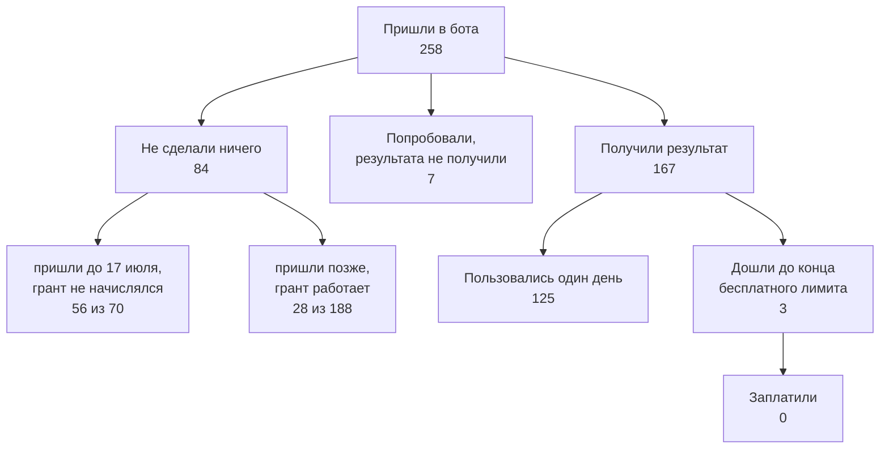

import { Image } from 'astro:assets';
import otterPricing from '../../../../assets/screenshots/otter-pricing-90min.png';

## Что решаем

Вы хотите раскрутить пет-проект, открываете нишу — а там уже кто-то работает, и обычно не один.

Это нормально. То, что нишу заняли, ещё не значит, что её сделали хорошо, а хорошо делают редко.

Сегодня продукт может собрать почти кто угодно, потому что писать код стало дёшево. Тяжело стало другое — чтобы вас нашли и чтобы вы могли объяснить, чем вы лучше тех, кто в этой нише уже сидит.

Вот это объяснение обычно и пропускают: садятся писать фичи, не ответив себе на вопрос. Дальше я покажу на своих цифрах, во сколько мне это обошлось.

## Шаги

### Что такое пет-проект и можно ли в нём брать деньги

Пет-проект — то, что вы делаете не по работе и не по чужому плану, то есть сами решаете, что и когда делать. Из этого почему-то часто выводят, что брать деньги нельзя.

Деньги ничего не портят, скорее наоборот. Бесплатным пользуются охотно, и это не говорит вам ровно ничего, а один человек, который заплатил, скажет о продукте больше, чем сто зарегистрировавшихся.

Поэтому про деньги стоит думать сразу. За что именно брать, за действие или за месяц, я разбираю отдельно: [модель монетизации](/ru/money/pricing-model/).

### Свободной ниши не будет, и искать надо не пустоту

Если ниша пустая, причина обычно одна из двух: либо задачи ни у кого нет, либо задача есть, но за неё не платят. Проверьте это первым делом — [платит ли аудитория хоть за что-нибудь](/ru/demand/will-they-pay/).

А если в нише кто-то работает, значит спрос уже есть и кто-то до вас проверил, что задача настоящая и за неё дают деньги.

Дальше всё просто. У любого работающего конкурента есть минимум одна вещь, сделанная плохо, и бесит она в том числе тех, кто ему платит.

Платящий терпит дольше всех, потому что он отдал деньги и не хочет признавать перед собой, что отдал их зря, — поэтому если он всё-таки сел писать отзыв, значит его правда достало.

Вот с этого и начинайте. Не спрашивайте «чего на рынке нет» — спрашивайте, что на рынке есть и раздражает.

> In the real world outside economic theory, every business is successful exactly to the extent that it does something others cannot.
>
> — Питер Тиль, «Competition Is for Losers», The Wall Street Journal, 12 сентября 2014 года. То же самое он пишет в третьей главе Zero to One.

И вторая цитата, про то, откуда берутся идеи.

> When something annoys you, it could be because you're living in the future.
>
> — Пол Грэм, «How to Get Startup Ideas», ноябрь 2012 года. Раздражение для него — не помеха, а подсказка.

### Где эта злость лежит открытым текстом

Интервью проводить не надо: люди уже всё написали сами, бесплатно, с датами и в открытом доступе.

**App Store отдаёт отзывы одной командой, без аккаунта.** Сначала находите id приложения, потом читаете ленту:

```bash
curl -s 'https://itunes.apple.com/search?term=otter&entity=software&country=us&limit=3'
curl -s 'https://itunes.apple.com/us/rss/customerreviews/page=1/id=1276437113/sortby=mostrecent/json'
```

На странице 50 отзывов, страниц около девяти, дальше пусто. В каждом есть дата, оценка и версия приложения: по версии видно, с какого релиза пошли жалобы. Страну меняете прямо в адресе — в `gb`, `fr` и `de` жалуются на разное.

Вот что я там нашёл. Otter на платном тарифе Pro режет запись на 90 минутах, и это не поломка: так написано в их прайсе, а четыре часа дают только тарифом выше.

<figure>
  <Image
    src={otterPricing}
    alt="Страница тарифов Otter.ai, четыре плана рядом. Basic бесплатный, в нём 300 минут расшифровки в месяц. Pro — $8.33 за пользователя в месяц с плашкой «save 51%», 1200 минут записи, и под заголовком «Everything in Basic, plus» первой строкой идёт «Up to 90 mins/meeting». Business — $19.99 за пользователя в месяц с плашкой «Best Value», безлимитные встречи, и под «Everything in Pro, plus» первой строкой «Up to 4 hours/meeting». Enterprise предлагает демо."
  />
  <figcaption>
    Тарифы Otter, снято 13 августа 2026 года. Цены годовые. Девяносто минут — это строка в прайсе, а не поломка. Два отзыва ниже написали люди, которые ушли из-за неё.
  </figcaption>
</figure>

А вот два отзыва. 2 августа 2026 года человек с подпиской за $99.99 в год ставит единицу.

> Paywalled out of seeing the last 19 minutes of an enthralling conversation.

За неделю до этого, 25 июля, двойка от другого человека.

> after several years of satisfying service, I am now forced me to move on to other providers

Оба платили. Оба ушли. И обоих остановила одна строка в прайсе — вот такую вещь вы и ищете.

**Считайте, а не листайте.** Я скачал всю ленту этого приложения и получил 209 отзывов на одну и две звезды, с 16 сентября 2024 по 3 августа 2026. Про деньги и лимиты — 118 отзывов, про то, что бот путает говорящих, — 11.

А я был уверен, что главная боль тут именно «кто из них сейчас говорит», хотя у платящих она проигрывает деньгам вдесятеро и узнать это можно было за десять минут.

**Форумы дают ссылки, которые не протухнут.** У отзыва в App Store нет постоянного адреса: придут новые отзывы, и он уедет на другую страницу, а ссылка в вашей статье будет вести в пустоту. Поэтому цитируйте форумы на Discourse — там у каждой темы свой URL.

```bash
curl -s 'https://community.openai.com/search.json?q=transcription+empty'
curl -s 'https://hn.algolia.com/api/v1/search_by_date?query=%22otter.ai%22&tags=comment'
```

Оба работают без ключа и без аккаунта, проверил 13 августа 2026 года.

**А вот это уже не работает, хотя советуют до сих пор.**

Рано или поздно вы захотите собирать жалобы не руками, а скриптом — с Reddit, из X, с сайтов-отзовиков вроде G2 и Capterra. Раньше так и делали, сейчас не выйдет.

- **Reddit** без регистрации приложения не отдаёт ничего: обычный запрос к ленте возвращает 403, и чтобы читать её из скрипта, нужен ключ OAuth, который заводят в настройках аккаунта.
- **Поиск в X** стал платным. Бесплатного чтения нет совсем, только предоплаченные пакеты.
- **G2 и Capterra** в 2026 году записали в правила запрет на автоматический сбор и отдельно назвали headless-браузеры. Открыть страницу и прочитать глазами можно. Натравить скрипт — нарушение.

Поэтому отзовики читайте руками, а скриптом собирайте App Store, Hacker News и форумы на Discourse.

### Чем оборачивается «сначала фичи»

Дальше мои цифры, и главное в них — не сами цифры, а то, как я их три месяца читал.

С 12 мая по 15 августа в боте зарегистрировались 258 человек. Вот что с ними стало.



**84 человека не сделали вообще ничего** — ни одной строки в таблице событий. Я читал это как «спроса нет», а потом разбил по датам.

Оказалось, что до 17 июля новым пользователям не начислялся стартовый грант, то есть человек заходил, видел ноль кредитов и не мог сделать вообще ничего. Это был мой баг, а не рынок. До 17 июля так ушли 56 человек из 70, после — 28 из 188.

И вторая половина той же истории. Кнопка «оставить отзыв» висела в боте всё это время, за три месяца ею воспользовались девять раз, и про то, что продукт вообще не работает, не написал ни один человек.

Так что молчание в данных — это не приговор спросу. Сначала проверьте, работал ли продукт.

Дальше про тех, у кого он работал: хотя бы раз получили результат 167 человек, и **125 из них пользовались один день**.

А до конца бесплатного лимита дошли **трое**, из них один попробовал ещё раз, и не заплатил никто. Самый низкий баланс — 16 кредитов, средний — 209.

То есть до стены freemium надо ещё дожить, и у меня почти никто не дожил. Фичи тут не помогли бы. Помогло бы починить начисление на два месяца раньше.

### Как назвать отличие одной строкой

Скажите про себя такое, что конкурент не сможет повторить, пока сам не переделается.

«Удобнее» и «быстрее» не годятся: так про себя говорят все, и проверить это нельзя, а хорошая фраза называет конкретное раздражение и конкретных людей, которых оно достаёт.

Скажите её вслух до первой строчки кода. Не выговаривается — значит отличия пока нет, и понять это сейчас куда дешевле, чем на трёхсотом пользователе.

## Что не сработало

- **Искать пустую нишу.** Пусто почти всегда там, где за задачу не платят, так что ищите не отсутствие конкурентов, а деньги.
- **Читать молчание как отсутствие спроса.** 84 человека из 258 не нажали ничего, и я три месяца считал это приговором нише, хотя у 56 из них просто был ноль кредитов из-за моего бага.
- **Ждать, что люди упрутся в бесплатный лимит.** Я строил экономику вокруг стены, до которой дошли трое. Уходили раньше и молча.
- **Верить, что о поломке напишут.** Кнопка обратной связи висела на видном месте, за три месяца пришло девять сообщений, и ни одного про сломанное начисление.
- **Читать среднюю оценку конкурента.** Средняя — результат маркетинга. Всё полезное лежит в единицах и двойках.
- **Считать регистрацию сигналом.** Регистрации выглядели как аудитория, а из тех, у кого продукт заработал, 125 зашли ровно один раз.
- **Ждать, что отличие придумается по дороге.** Не придумалось. Оно либо есть до кода, либо потом дописывается в описание задним числом и не убеждает никого.

## Проверить

- Назовите вслух одного живого конкурента и одну вещь, которая у него работает плохо. Вторую не выходит — значит вы ещё не искали.
- Найдите ту же претензию у трёх разных людей, в трёх разных местах и с датами, потому что одна жалоба — это один человек, а не рынок.
- Проверьте, что хотя бы один из них платит. Жалоба бесплатного пользователя стоит дешевле: он ничем не рисковал.
- Скажите отличие одной фразой, без слов «удобнее» и «быстрее». Конкурент может повторить её дословно — это не отличие.
- Посмотрите, сколько ваших пользователей не сделали ни одного действия. Такой цифры нет — значит [строка события её не несёт](/ru/analytics/product-metrics/).

Вы поняли, что делаете и чем отличаетесь. Дальше — под какой рынок это строить: [под какой рынок строить](/ru/demand/pick-a-market/).
