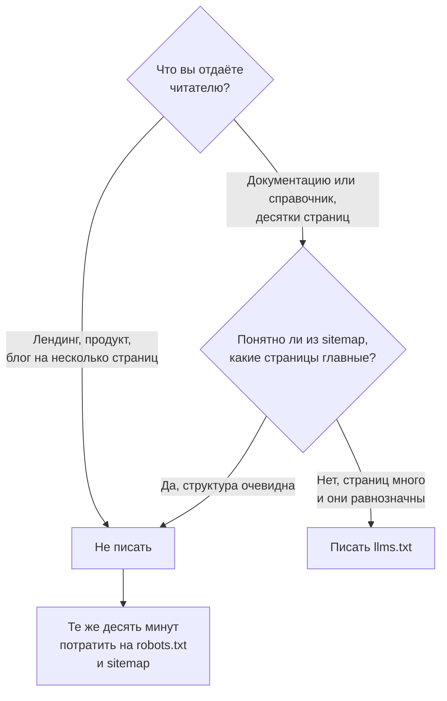

## Что решаем

Кому разрешено читать сайт, решаете вы. На большинстве проектов это решение принимают случайно, в панели, которую никто не открывал. А если crawler до вас не дошёл, в AI-ответах вас нет, и насколько хорошо написана страница, после этого уже неважно.

Ловушка сидит в самих словах «AI-бот»: за ними прячутся три разные работы, и отказать в доступе каждой из трёх стоит по-разному.

## Шаги

Сначала разложите агентов по работе, а решайте потом. Поисковый crawler, обучающий crawler и загрузчик по просьбе пользователя — это три разных решения.

| User agent | Владелец | Работа | Чего стоит блокировка |
|---|---|---|---|
| `OAI-SearchBot` | OpenAI | Поисковый индекс | Вас нет в результатах поиска ChatGPT |
| `ChatGPT-User` | OpenAI | Загрузка по просьбе пользователя | Почти ничего — OpenAI пишет, что robots.txt здесь может не применяться |
| `GPTBot` | OpenAI | Обучающий корпус | В сегодняшних ответах — ничего |
| `Claude-SearchBot` | Anthropic | Поисковый индекс | Вас нет в веб-результатах Claude |
| `Claude-User` | Anthropic | Загрузка по просьбе пользователя | URL, который вставит ваш читатель, в чате не откроется |
| `ClaudeBot` | Anthropic | Обучающий корпус | В сегодняшних ответах — ничего |
| `PerplexityBot` | Perplexity | Поисковый индекс | Вас нет в движке с самой ясной атрибуцией |
| `Perplexity-User` | Perplexity | Загрузка по просьбе пользователя | Почти ничего — Perplexity пишет, что обычно игнорирует robots.txt |
| `Google-Extended` | Google | Управляющий токен | Вне обучения Gemini и grounding в Vertex AI |
| `GoogleOther` | Google | Разные внутренние загрузки | В AI-ответах — почти ничего |
| `CCBot` | Common Crawl | Открытый корпус для обучения | В сегодняшних ответах — ничего |

### Что писать в robots.txt, если ничего особенного не нужно

Четыре строки, и на большинстве проектов файл на этом заканчивается.

```text
User-agent: *
Allow: /

Sitemap: https://example.com/sitemap-index.xml
```

Именно это отдаёт данный сайт. Имя агента я пишу, только когда его надо закрыть. Список разрешённых поимённо кому-то потом придётся поддерживать, а новые имена вендоры выпускают быстрее, чем кто-нибудь возвращается перечитать файл.

Читайте то, что отдаёт боевой домен, а не то, что лежит в репозитории, потому что CDN умеет переписать этот файл по дороге.

```bash
curl -sS https://example.com/robots.txt
```

Managed-версия Cloudflare живёт на странице **Security Settings** зоны, под фильтром **Bot traffic**. Она есть на всех тарифах. Если её включить, она допишет свои строки `Disallow` перед вашими, а домену на Free-тарифе без собственного файла Cloudflare отдаёт вместо него свою Content Signals Policy.

Поисковые агенты и агенты, которых вызвал человек, решают, есть ли вы в сегодняшнем ответе. Обучающая группа — вопрос ценностей. Только ради неё я вообще стал бы набирать чьё-то имя.

### Кого ваши правила вообще обязывают

Crawler соблюдает `robots.txt`. Загрузчик соблюдает не всегда. Разрыв между ними достаточный, чтобы испортить весь диагноз.

OpenAI пишет: раз действие инициировал пользователь, правила robots.txt могут не применяться, а Perplexity говорит, что её user agent обычно этот файл игнорирует по той же причине. Anthropic — исключение. Она пишет, что её боты файл соблюдают.

То есть одна и та же строка `Disallow` у трёх вендоров ведёт себя тремя способами. По вашему файлу этого не видно. Видно только по документации вендора.

### `Google-Extended` выключает не то, что кажется

Это управляющий токен. Своего user agent у него нет, так что в логе вы его никогда не увидите. На ранжирование он не влияет. Покрывает он обучение моделей Gemini и Grounding with Google Search в Vertex AI.

В Google Search его блокировка не меняет ничего. AI Overviews — часть Search, и страницы для них обходит обычный `Googlebot`.

### Как выйти из AI Overviews по-настоящему

Для этого есть отдельный контрол: Search Console, Settings, Search generative AI. Он покрывает AI Overviews, AI Mode и генеративные блоки в Discover, а Google пишет, что сигналом ранжирования в остальном Search он не служит.

`nosnippet`, `data-nosnippet` и `max-snippet` тоже выводят. Только они забирают с собой и обычный сниппет в выдаче. Отдельный контрол такой цены не берёт, но раскатывают его пока на часть владельцев, так что у вас в ресурсе его может ещё не быть.

### Если всё-таки называете агентов, всё решает порядок групп

RFC 9309 говорит, что crawler слушается одной группы — той, чьё имя совпало с ним точнее всего, так что щедрый `User-agent: *` ниже не спасёт агента, которого вы закрыли выше.

Правило работает в обе стороны. Кусается оно так: одна протухшая группа молча перебивает wildcard под собой. Поэтому поимённого списка разрешений я не завожу вообще.

### Где блокировка стоит на самом деле

Под `robots.txt` лежат ещё три слоя: заголовок `X-Robots-Tag`, мета-тег и edge. В самом файле не виден ни один из них, а отвечать 403 может переключатель в CDN, правило WAF или rate limit, пока вы правите файл, который никто не читает. WAF — это firewall, который матчит HTTP-запросы.

В Cloudflare этот контрол называется **Configure AI bot policies** и лежит на странице **Security Settings** зоны. Он есть на всех тарифах, включая Free. Агентов он раскладывает на Search, Agent и Training, и для каждой группы доступно Allow, Block on all pages или Block only on pages with ads.

Кто попадает в каждую группу, решает список Cloudflare. Меняется этот список без вас. Block здесь терминирующий. Cloudflare отвечает 403 из своей сети, и ваш сервер запроса не видит.

С 15 сентября 2026 новый для Cloudflare домен приезжает с блоком Training и Agent на страницах с рекламой, а старый одиночный переключатель рядом, **Block AI bots**, в тот же день уходит. Существующие зоны сохраняют свои настройки. Отказаться от новых умолчаний можно до 15 сентября.

Та же панель умеет не отказывать, а брать деньги: pay per crawl отвечает 402 и живёт в закрытой бете.

### Имя в логе — это заявление, а не личность

Строку user agent может отправить кто угодно. Я и отправил: мой собственный цикл на `curl` положил в access-лог имена вендоров, и две недели я читал эти строки как визиты. Вендоры публикуют диапазоны IP и обратный DNS для своих crawler, так что сверяйтесь с ними, прежде чем считать строку лога доказательством визита или атаки. Чего мне это стоило, разобрано в [кто к вам на самом деле ходит](/ru/geo/who-actually-crawls-you/).

### Стоит ли писать llms.txt

Короткий ответ — по одному признаку: есть ли у вас документация, в которой агенту трудно найти нужную страницу самому.



То есть `llms.txt` решает ровно одну задачу: сказать словами, какие из ваших страниц читать первыми. Если страниц пять и они и так на виду, задачи нет.

Файл стоит десять минут. Читать его никто из вендоров не обязался, и вот что было у меня за 16 дней:

| Кто забирал `llms.txt` | Обращений |
|---|---|
| мой собственный `curl` | 44 |
| `SiteAuditBot` (Semrush) | 1 |
| AI-агенты | 0 |
| **всего** | **45** |

Для сравнения: `robots.txt` за то же окно забрали 56 раз, и там это были настоящие краулеры.

Две оговорки, без которых этот ноль читать нельзя. Окно дырявое: logrotate держит 14 суточных архивов, и записи с 20 по 28 июля не сохранились. И ещё: запрос, зарезанный на edge, до nginx не доходит, в таблицу выше он не попадает вообще, и со стороны сервера этого не увидеть никак. Поэтому я сходил и сверил обе стороны за одни сутки:

| | Cloudflare | nginx |
|---|---|---|
| Всего запросов | 668 | 672 |
| 200 | 651 | 648 |
| 404 | 13 | 13 |
| **403** | **0** | **0** |

Числа сходятся. Ни одного 403 нет ни там, ни там, то есть мой edge не режет никого. Разница в четыре запроса — это окно: на стороне nginx оно на час шире, а точнее свести не дал бесплатный тариф Cloudflare, который отдаёт аналитику окном не больше суток.

Проверять надо именно так. Если бы edge резал, счётчик Cloudflare был бы заметно больше серверного, и эта разница была бы ответом. Разбор целиком: [кто к вам на самом деле ходит](/ru/geo/who-actually-crawls-you/).

То есть на маленьком сайте про продукт вы ставите десять минут против измеренной отдачи 0, а в документации на сорок страниц ставка разумная. В остальных случаях я бы эти десять минут потратил на `robots.txt` и sitemap. Их забирают все.

Сам формат короткий: H1 первой строкой, под ним цитата в одно предложение, абсолютные ссылки, описание после каждого двоеточия. `robots.txt` говорит, в какие пути не ходить. `llms.txt` говорит вашими словами, что стоит прочитать.

```markdown
# Название проекта

> Одно предложение о том, что это и для кого.

## Docs

- [Заголовок страницы](https://example.com/page): о чём она и когда пригодится.

## Optional

- [Второстепенная страница](https://example.com/extra): можно пропустить при жёстком лимите контекста.
```

### Кто приходил на самом деле — это скажет только лог

Поддержка `llms.txt` — договорённость, а не стандарт, соблюдать который кого-то заставляют, поэтому честный ответ про своих гостей лежит в access-логе.

```bash
zcat -f /var/log/nginx/example.access.log* \
  | grep -icE 'chatgpt-user|oai-searchbot|gptbot|perplexity|claude-user|claudebot|meta-externalagent'
```

Мой лог посчитан в [кто к вам на самом деле ходит](/ru/geo/who-actually-crawls-you/). Там же граница этого метода: запрос, который заблокировал edge, до вашего сервера не доходит. Строкой в логе он не становится. Грепните агента, которому Cloudflare отказывает, и не найдёте ничего, так что лог прочитается так, будто к вам никто не приходил.

Эти запросы считаются по ту сторону блокировки: Cloudflare считает их в **AI Crawl Control**, во вкладках **Crawlers** и **Metrics**. Сама блокировка ложится в **Analytics** → **Events** и на Free-тарифе хранится 24 часа.

## Что не сработало

- **Закрыть всех, чтобы сэкономить трафик**. Блокировка стояла на edge, в собственной AI-настройке CDN, а не в `robots.txt`, где я её искал. Agent — одно из трёх поведений, которые эти настройки покрывают. Вместе со всеми остановились и загрузчики. Читателю, который вставил URL в чат, ответили, что страницу открыть нельзя.
- **Потерять цитирование вместе со счётом**. Самый активный AI-агент в моём логе сделал 341 запрос за 16 дней — [кто к вам на самом деле ходит](/ru/geo/who-actually-crawls-you/). Это `ChatGPT-User`, и запускает его человек. Что этим человеком был не я, доказать не могу. Выключить такой трафик легко. Вернуться потом в ответы — трудно.
- **Сделать `llms.txt` обязательным пунктом**. Эта страница велела его публиковать, и маршрут повторял указание. Потом мой лог за 16 дней записал 0 обращений от AI-агентов. Обязательным шагом я его называть перестал. Условие теперь одно: у вас документация для разработчиков.
- **Разрешать агентов в `robots.txt` поимённо**. Маршрут просил читателя перечислить каждого поискового агента и каждый загрузчик. Сам сайт так не делал никогда: он отдаёт `User-agent: *` и `Allow: /`. Поимённый список протухает, и следить за ним придётся вам. А RFC 9309 позволяет протухшей группе перебить wildcard под собой.
- **Запрещать `Google-Extended`, чтобы убрать себя из AI Overviews**. Это строка в `robots.txt`, и отвечает она совсем за другое. За обучение моделей Gemini и за то, подтягивает ли Gemini ваши страницы себе в ответ. Страницы для AI Overviews обходит обычный `Googlebot`, так что мой запрет не изменил ничего. Нужный переключатель лежал в Search Console, под Settings → Search generative AI.
- **Выходить из AI Overviews через `nosnippet`**. Так на этой странице и было написано — до 3 июня 2026, когда Google выкатил отдельный контрол в Search Console. Директивы сниппета вдобавок отбирают обычный сниппет в выдаче. Отдельный контрол такой цены не берёт.
- **Верить странице вендора, которая перестала обновляться**. В документации Google `ai-features` до сих пор перечислены только директивы сниппета, а обновлена она 2025-12-10. Моя страница честно повторяла источник, а источник успел протухнуть.
- **Написать `Disallow` для `ChatGPT-User` и считать это блокировкой**. OpenAI пишет, что загрузка по просьбе пользователя может игнорировать robots.txt. Perplexity пишет то же самое про свою. Я вежливо просил клиента, которому вендор уже разрешил не слушаться.
- **Править `robots.txt`, пока блокировал edge**. Файл разрешал каждого агента поимённо. Правило bot-protection перед ним отдавало 403. В логе не было ни одной успешной загрузки. Это правило не видно ни в `robots.txt`, ни в исходнике страницы, ни в логе сервера. Видно его только в security events самого CDN.
- **Перечислять в `llms.txt` планы**. Строка в этом файле — обещание, что страница за ней написана. Ссылка на ненаписанную страницу учит игнорировать весь файл целиком. И человека, и модель.
- **Считать `robots.txt` запретом**. Это просьба. Воспитанный crawler её выполняет. Скрапер её игнорирует, и остановит его только edge — или не остановит никто.

## Проверить

Запустите `geo-crawlers` из раздела [Tools](/ru/tools/). Он читает `robots.txt`, мета-теги и заголовки ответа и отдаёт карту доступа по агентам, и так находится правило, о котором вы забыли.

Оттуда же запустите `geo-llmstxt`. Он проверяет существующий файл или собирает черновик по структуре сайта, а ссылки, ведущие в никуда, помечает.

Потом проверьте снаружи:

- Сначала выясните, что вообще стоит перед вашим сервером.

  ```bash
  curl -sI https://example.com | grep -iE '^(server|via|cf-ray):'
  ```

  Заголовок `cf-ray` означает Cloudflare. Vercel, Netlify и Fastly представляются своими заголовками. Если впереди нет ничего, отказать crawler'у могут только файрвол и веб-сервер, и проверки ниже тогда переезжают туда.
- На Cloudflare откройте **Security Settings** и прочитайте, что стоит в **Configure AI bot policies**. Умолчание вы не выбирали, но настройка всё равно ваша.
- Откройте **Analytics** → **Events** и отфильтруйте действие по Block. Агентов, которым отказали там, нет ни в одном логе на вашей машине.
- Запросите страницу как crawler, из чужой сети, и убедитесь, что пришло 200.

  ```bash
  curl -s -o /dev/null -w '%{http_code}\n' -A 'OAI-SearchBot' https://example.com/
  ```
- Если `llms.txt` опубликован, заберите его так же и проверьте, что каждая ссылка в нём отдаёт 200.
- Попросите ассистента открыть один из ваших URL. Не может — значит блокировка реальна. На каком слое она стоит, показывают проверки выше.
- Запишите минуту, в которую вы это сделали. В логе она ляжет как `ChatGPT-User` или `Claude-User`, с адреса вендора. От визита постороннего человека её не отличить.

Доступ — это только ворота. Что процитируют дальше — отдельная задача: [почему AI цитирует не вас](/ru/geo/citable-pages/).
