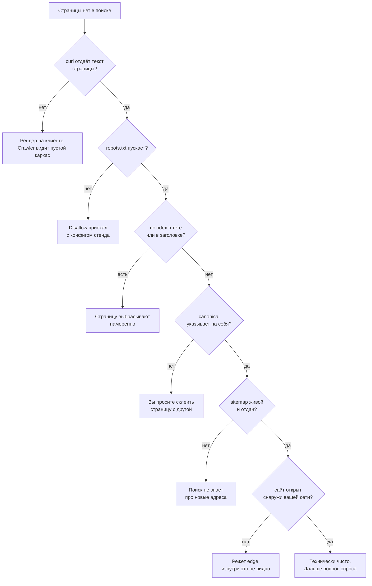

## Что решаем

Сайт в проде уже недели, а поиск по нему не отдаёт ничего. Не слабая позиция — вообще ни одного результата.

Индексация ломается сверху вниз. Сначала crawler должен забрать страницу, потом обойти её, потом проиндексировать, и только после этого страница может ранжироваться.

Переписанный `title` на странице с `noindex` не меняет ничего. Поэтому проверки ниже идут по порядку: останавливайтесь на первой, которая упала, — пока страница заблокирована, всё остальное вы всё равно не измерите.



## Шаги

### Получает ли crawler хоть какой-то текст

Первым делом я смотрю, что отдаёт сервер до всякого JavaScript. Заберите страницу и найдите в ответе то предложение, которое на ней видно глазами:

```
curl -sL https://example.com/page | grep -i "фраза, которую видно на странице"
```

Если grep молчит, а в браузере текст есть, значит текст дорисовывает браузер: такое приложение отдаёт почти пустой `<body>`, и crawler получает страницу, в которой нечего индексировать. Чинят это серверным рендерингом или пререндером на сборке. Тегами не чинится.

### Что на самом деле написано в вашем robots.txt

Заберите файл с боевого домена и прочитайте целиком — не по памяти и не только те строки, которые вы туда писали сами:

```
curl -s https://example.com/robots.txt
```

Классика — `Disallow: /`, приехавший из конфига стенда вместе с деплоем. Бывает поломка и тише: Google перестаёт читать файл после 500 кибибайт, сгенерированный robots может молча обрезаться где-то посередине, и всё, что было ниже обрыва, для Google не существует.

### Не просите ли вы поиск выбросить страницу

`noindex` живёт в двух местах. Мета-тег лежит в HTML, и его видно в исходном коде страницы, а заголовок ответа `X-Robots-Tag` не показывается там вообще:

```
curl -sI https://example.com/page | grep -i x-robots-tag
```

`curl -sI` шлёт HEAD-запрос и печатает одни заголовки, а в браузере то же самое лежит во вкладке Network, в запросе документа, в секции Response Headers.

Заголовок ставит фреймворк, веб-сервер или CDN. Это три разных файла, и открыть придётся каждый. Есть ещё форма для конкретного агента — `X-Robots-Tag: googlebot: noindex`, — и выглядит она как обычная строка конфигурации, поэтому глаз её пропускает.

Страницу с `noindex` поиск честно забирает и разбирает. А потом намеренно выбрасывает.

### Сколько у страницы адресов и куда она показывает

Каждая страница должна указывать canonical на себя или на реальный оригинал:

```
curl -sL https://example.com/page | grep -i 'rel="canonical"'
```

Бывает шаблон, который на всех страницах разом ставит canonical на главную, и так вы сами просите поиск выкинуть весь остальной сайт.

Дальше посмотрите, сколько разных адресов отвечают одной и той же страницей: слеш в конце, `www`, `http`, `index.html`, параметры трекинга — все они должны редиректиться к одной форме:

```
for u in http://example.com/page https://www.example.com/page https://example.com/page/ https://example.com/page/index.html; do
  curl -o /dev/null -sw "%{http_code} %{redirect_url}\n" "$u"
done
```

Иначе сигнал делится между дублями и sitemap начинает спорить с тегом canonical. Этот спор поиск разберёт сам, без вас.

### Живой ли sitemap, а не просто лежит ли он

Проверяйте не наличие файла. Проверяйте, что каждый URL в нём отвечает 200 и что записан он полным адресом, в канонической форме:

```
curl -s https://example.com/sitemap.xml | grep -o '<loc>[^<]*' | cut -c6- |
  while read -r url; do curl -o /dev/null -sw "%{http_code} $url\n" "$url"; done
```

Протокол ограничивает один файл 50 000 URL и 50 МБ без сжатия. Дальше файл надо разбить и добавить sitemap index, а если карта набита редиректами и 404, её вообще перестают читать как источник правды о сайте.

### Видно ли сайт снаружи вашей сети

Последнюю проверку нельзя запускать со своей машины. Резолвите домен с чужого адреса и запрашивайте страницу без кук:

```
ssh other-box 'curl -sI https://example.com/page'
```

Access-контроль, basic auth и bot-правила на edge отдают логин-форму или 403. В `robots.txt` ничего этого не видно.

У правила на edge есть имя и экран, где оно лежит: в Cloudflare это **Configure AI bot policies** на странице **Security Settings** зоны, на всех тарифах. Подходящему агенту Cloudflare отвечает 403 из своей сети, и до вашего сервера такой запрос не доходит.

Поэтому в логе сервера отказа тоже нет: увидеть его можно только в **Analytics** → **Events** у Cloudflare. Весь механизм разобран здесь: [AI-crawler и llms.txt](/ru/geo/llms-txt-and-crawlers/).

## Что не сработало

- **Ждать, пока индекс догонит**. Crawler действительно возвращается, читает то же правило и уходит. Терпение не правит заголовок.
- **Отправить один URL заново в инструменте проверки**. Перезапрос идёт по тому же `robots.txt`, с тем же заголовком и тем же пустым телом. Вердикт вернётся тот же. Дневная квота потрачена.
- **Считать доказательством доступа отчёт стороннего crawler**. Отчёт показывает, что чужой бот смог забрать страницу со своего адреса, а оставит ли поиск эту страницу у себя — вопрос совсем другой.
- **Проверять только со своего ноутбука**. У вас залогиненная сессия, прогретый service worker и домашняя сеть, которой edge уже доверяет, и всё это вместе прячет поломку целиком. Edge — это CDN перед вашим origin: Cloudflare, Fastly, облачный балансировщик. Часть запросов он отвечает сам, и до вашего сервера они не доходят.
- **Править `robots.txt`, когда блок жил на edge**. Правила bot-protection и WAF в этом файле не видны, и сам файл был чистым всё это время. Искать надо **Configure AI bot policies** под **Security Settings** у Cloudflare и любое custom-правило WAF рядом — это самый частый спрятанный блокер, который мне попадается.
- **Сначала переписать `title` и описания**. На странице, которой нет в индексе, работа с текстом не даёт ничего измеримого.

## Проверить

Запустите скилл `seo-audit` из раздела [Tools](/ru/tools/): он идёт тем же порядком и собирает ответы в один отчёт, а руками то же самое занимает больше времени.

Потом проверьте руками то, что отчёт подделать не может:

- `curl -sI` на странице отдаёт 200 и не несёт `X-Robots-Tag`.
- `curl -sL` на том же URL содержит предложение, которое видно на странице.
- URL Inspection в Search Console говорит, что URL есть в Google.
- В **Analytics** → **Events** у Cloudflare, с фильтром по действию Block, для ваших URL пусто, потому что заблокированный crawler виден там и больше нигде.

Сколько страниц вообще дошло до индекса, грубо видно прямо из поисковой строки:

```
site:example.com
```

Формулировки в Search Console читайте буквально. «Discovered — currently not indexed» значит, что URL известен и не был забран, а «Crawled — currently not indexed» — что URL забран и признан не стоящим хранения. Это два разных бага, и чинят их по-разному.

Как только в индекс попала первая страница, отдавайте остальные: [отдать и проверить](/ru/indexing/submit-and-verify/).
