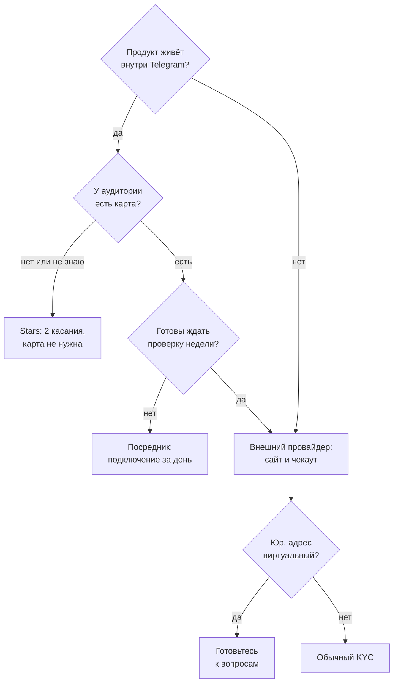

## Что решаем

Цена у вас есть, а взять по ней деньги нечем. Выбор рельса выглядит как выбор комиссии, и в сравнительной таблице он им и остаётся. На деле решают две вещи, которых в таблице нет: пустят ли вас вообще и что случится между «человек заплатил» и «человек получил купленное».

Комиссия — самая дешёвая часть этого выбора. Мой рельс определился не процентом, а тем, у кого из аудитории есть карта, и тем, сколько недель провайдер проверял, что я такое.

## Шаги

### Сколько берут три рельса

| | Stars | Tribute | Paddle |
|---|---|---|---|
| Комиссия | процент не публикуется | 10% с транзакции | 5% + $0.50 с чекаута |
| Где платят | внутри Telegram | внешняя ссылка | ваш сайт |
| Карта | не нужна | российские | зарубежные |
| Деньги на руки | через Fragment | рубли и евро | USD, EUR, GBP |

У Stars процента нет, потому что Telegram его не печатает. Считать приходится по двум документированным числам: разработчик получает **вознаграждение 0.013 USD за звезду**, а та же звезда, потраченная на рекламу внутри Telegram, стоит **0.02 USD**. Разница между этими числами и есть цена вывода денег, и в процентах её никто не называет.

Там же лежат два срока, которые в таблицу комиссий не попадают: звёзды становятся доступны **до 21 дня** после получения, а действуют три года.

### Пустят ли вас — это отдельный вопрос, и он дороже

Комиссию видно сразу, а проверку — нет. Мой прогон через Paddle занял три месяца календаря: заявка, отмена звонка, переброс в self-serve, риск-ревью, потом KYC у стороннего сервиса проверки личности.

Дольше всего не проходило **подтверждение адреса**, и отказ пришёл сразу по трём основаниям.

Виртуальный юридический адрес — это адрес бизнеса, жильём он не считается. Договор об услугах не входит в список принимаемых документов. И он оказался старше лимита в шесть месяцев.

Прошёл обычный счёт мобильного оператора за прошлый месяц: в нём есть имя, жилой адрес и свежая дата.

Виртуальный офис как адрес регистрации — известная точка трения у платёжных провайдеров: по одному адресу сидят сотни компаний. Если вы регистрировались так, закладывайте недели.

### Платёж приходит анонимным

Это главное, что ломается в коде, и ломается тихо. Чекаут открывается в браузере, а начислять надо конкретному пользователю бота — провайдер про него не знает ничего.

**Не передавайте свой идентификатор пользователя в чекаут.** Он задаётся на клиенте, значит подменяется, и любой желающий начислит покупку кому угодно. Наружу уходит идентификатор намерения, которое вы создали у себя в базе до оплаты, и без строки в этой базе он не значит ничего.

Там же, в намерении, фиксируется купленное количество. Читать его в вебхуке из прайса нельзя: между оплатой и доставкой события цена может поменяться, а человек должен получить то, что видел на экране.

### Правила вебхука, которые стоили крови

- **Идемпотентность.** Провайдер доставляет событие как минимум однократно, и дубль здесь — норма. Повтор обязан закрыть намерение тем же результатом и не начислить второй раз.
- **Ошибка начисления — это 5xx, а не 200.** Деньги уже у вас, пусть провайдер ретраит, пока покупка не доедет. А платёж без вашего идентификатора намерения — наоборот 200: обработать его не выйдет никогда.
- **Пустой секрет подписи не означает «пускаем всех».** Проверка при пустом секрете обязана возвращать «не прошло».
- **Подпись считается от сырого тела запроса.** Пересобранное из разобранного JSON тело байт в байт не совпадёт.
- **Суммы приходят в минимальных единицах строкой.** `"500"` — это пять долларов. Место ошибиться в сто раз.
- **У Stars ретраев нет.** Оплата приезжает одним обновлением, второй доставки не будет. Любой сбой начисления обязан оставить строку в журнале и алерт: иначе о взятых деньгах без товара знает только клиент.

## Что не сработало

- **Считать, что рельс выбирается по комиссии.** Я сравнивал проценты, пока три месяца уходили на проверку. Решило не число, а то, что у части аудитории просто нет зарубежной карты.
- **Виртуальный юридический адрес в KYC.** Отклонён трижды подряд по трём разным основаниям, и каждый круг — это дни ожидания. Обычный счёт за мобильную связь прошёл с первого раза.
- **Ждать письма со ссылкой на верификацию.** Ссылку на проверку личности мне прислали в переписке, а письма с ней не оказалось ни в одной папке почты. Неделя ушла на ожидание того, что уже лежало в ответе.
- **Отдавать идентификатор пользователя на клиент.** Первая версия чекаута брала его из ссылки. Это значит, что купить кредиты чужому аккаунту мог кто угодно, и заметить это по логам оплат нельзя никак.
- **Держать цену пакета только в прайсе провайдера.** Вебхук читал количество кредитов оттуда, и правка цены задним числом меняла бы то, что получит человек, уже нажавший кнопку.
- **Молчать при сбое начисления.** У звёзд нет второй попытки. Без строки в журнале деньги списаны, товара нет, а узнаете вы это от клиента — если он напишет.

## Проверить

- Отправьте вебхук провайдера дважды с одним и тем же телом. Второй раз обязан ничего не начислить и вернуть тот же ответ.
- Подмените в чекауте всё, что видно в браузере, и убедитесь, что покупка не может уехать на чужой аккаунт.
- Оплатите минимальный пакет своей же картой и пройдите путь целиком, до строки в журнале и до баланса.
- Уроните базу в момент обработки оплаты и посмотрите, что останется: строка со сбоем и алерт — или тишина.
- Посчитайте, сколько вы получите на руки с самого дешёвого пакета после комиссии. Если получается меньше стоимости обслуживания одного такого клиента, дешевле не продавать.
