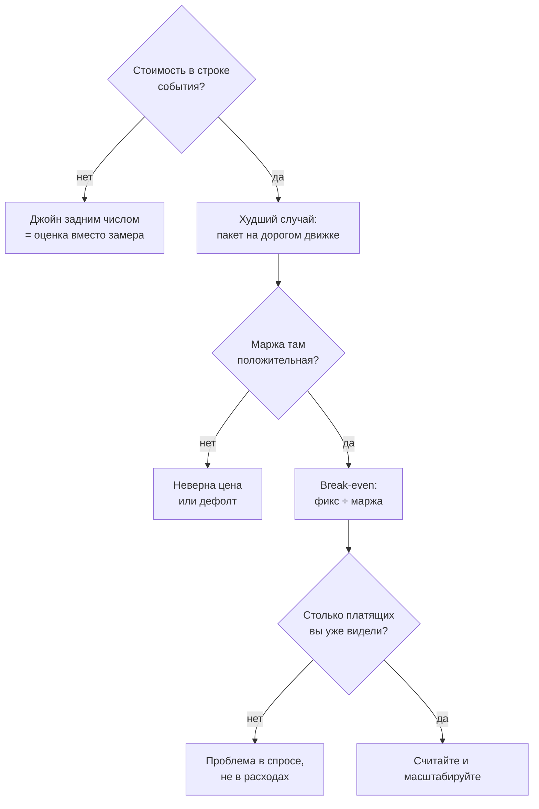

## Что решаем

Каждое действие пользователя тратит у провайдера настоящие деньги. Пока я не знаю, во сколько обходится одно действие, любую названную цену я просто угадываю с уверенным лицом.

Вопрос закрывают два числа: переменная стоимость одного действия и фиксированная стоимость месяца, в который не пришёл никто. Break-even считается из них и выражается в платящих за месяц. Процент маржи не отвечает, продолжать или нет. «Два человека в месяц» — отвечает.




## Шаги

### Какие расходы растут, когда приходит человек

Разведите расходы на две корзины один раз и письменно. Оптимизируются они по-разному. Фиксированное — сервер, домен и любой тариф, который списывается независимо от того, пришёл кто-нибудь или нет, а переменное — токены, символы, секунды и плата за вызов.

Коробка, на которой крутятся три проекта, входит в этот продукт своей долей. Долю надо назвать вслух. Я держу её именованной константой, а рядом комментарий со списком проектов, и когда набор меняется, я правлю одно число, вместо того чтобы искать его по всей модели.

### Сколько на самом деле стоит одно действие

Стоимость вызова пишите в ту же строку события, что и результат, и пишите сразу, потому что через час взять её будет уже неоткуда. Многие API отдают usage прямо в ответе, некоторые — сразу списание в деньгах, а если ваш отдаёт только количество, храните количество и умножайте на тариф из таблицы.

Колонка и чтение из неё выглядят примерно так — имена здесь условные, схема у вас своя:

```sql
-- заполняется из ответа провайдера, в том же запросе, что и результат
alter table events add column cost_usd numeric(12, 6);

-- сколько было действий, у скольких из них есть цена и во что они обошлись
select count(*)         as actions,
       count(cost_usd)  as priced,
       sum(cost_usd)    as spend
from events
where created_at >= date_trunc('month', now());
```

Смотрите тут на разницу между `actions` и `priced`. У меня такой колонки не было вообще, и я об этом не знал, поэтому стоимость я каждый раз добирал джойном к таблице тарифов, уже потом. Тарифы меняются, джойн берёт сегодняшние — и ответ про май тихо уезжает. А на графике добранное выглядит ровно как замеренное.

Что ещё должно лежать в строке события и почему именно в момент вставки — [что должна нести строка события](/ru/analytics/product-metrics/).

### Что будет, если человек спустит весь пакет на дорогой движок

Два движка с разной ценой не уживутся в одной модели, пока вы не переведёте расходы в ту единицу, которую продаёте: это кредиты, минуты, сообщения — что там лежит в пакете.

И считайте по худшему случаю. Пользователь имеет полное право спустить весь пакет на самый дорогой движок. Нижняя граница маржи — минимум по пакетам, посчитанный именно на этом движке, и приемлемым должно быть именно это число, а не среднее по всем.

### Сколько от чека реально доедет

Комиссия платёжного канала уходит раньше маржи, и на маленьком чеке видно это особенно хорошо. Читайте условия самого канала. Не считайте, что до вас доедет весь чек.

### Сколько человек закрывает месяц

Дальше арифметика, ради которой всё и считалось:

```text
вклад с платящего = цена пакета − переменная стоимость пакета − комиссия канала

break-even        = ceil( фиксированные расходы за месяц / вклад с платящего )
                    измеряется в платящих за месяц
```

Округление вверх до целых людей — не придирка: долю человека продать нельзя. Подставьте свои числа, и выйдет что-то вроде «два человека в месяц» — такое держится в голове и произносится вслух.

### Не я ли этот платящий

Свои аккаунты вычитайте явным списком id, и вычитайте первым действием, до любой агрегации. Считайте уникальных платящих: три покупки одного человека — это один платящий.

Если этого не сделать, первым платящим в вашей модели окажетесь вы сами. И модель этого никак не покажет.

### Откуда модель берёт факт и почему она протухает

Факт тяните из прода, иначе модель тихо стареет. Источник недоступен — берите кэш, но помечайте вывод датой, потому что молча состарившиеся числа дают решения про прошлый квартал.

Формулы держите в коде: тогда известные входы становятся юнит-тестами, а протянутая мышью ячейка не перепишет модель без предупреждения.

### Какой движок получают почти все

Дефолтом ставьте самый дешёвый движок, который проходит по качеству. Дефолт получают почти все. Ваши настоящие расходы описывает путь по умолчанию, поэтому дорогой движок должен жить за осознанным выбором.

## Что не сработало

- **Дефолт на самом дорогом провайдере.** Одна строка конфига стоила разом маржи, скорости и бесплатной квоты. Почти каждый запрос уходил в платный премиум-движок, пока бесплатный стоял без дела. Отвечал он медленно, люди сидели и смотрели на плейсхолдер. Каждая секунда его вывода тратила кредиты, которых бесплатный движок не потратил бы.
- **Два независимых лимита на один ресурс.** Баланс кредитов и отдельный дневной потолок на один движок. Самый вовлечённый пользователь месяца упёрся в потолок, когда на балансе у него ещё оставались кредиты. Он больше не вернулся.
- **Читать лимит ключа как деньги.** Лимит ключа показывает потолок трат, а не баланс. Он спокойно рисует запас, когда на счёте уже пусто. Узнал я это не в панели провайдера, а изнутри собственного продукта — ошибкой «требуется оплата».
- **Не проверить, чей это ключ.** Ключ из локального конфига принадлежал другому аккаунту. Всё это время тратились его кредиты, пока мой лежал нетронутым. Владельца надо устанавливать через endpoint ключа у провайдера, до того как ключ попадёт в `.env`.
- **Считать выручкой свою же тестовую покупку.** Модель на день показала, что безубыточность взята. Платящим был я, через тестовый аккаунт. В агрегацию моя покупка вошла наравне со всеми.
- **Резать пару долларов фиксированных расходов, пока платящих нет.** Со знаменателем и так всё было в порядке, я его и уменьшал. Без первого платящего никакая безубыточность недостижима. Работа всё это время лежала в спросе.
- **Держать тарифы в таблице, которую продукт не читает.** Таблицы цен в проде были пустыми, код работал на зашитом fallback. Я несколько раз менял цену, и до пользователя не доехало ничего.
- **Строить матрицу сценариев вместо замера.** Оптимистичная и пессимистичная колонки спорили о марже, которую никто ещё не заработал. Спор закончила одна записанная стоимость действия.

## Проверить

- Сделать одно реальное действие и прочитать стоимость, записанную в его событие. Null или ноль значит, что вы прикидываете и называете это замером.
- Сложить записанные стоимости за месяц и сравнить с дашбордом провайдера за тот же период. Расхождение — это неверный тариф или незаполненное поле, и часа оно стоит.
- Сверить расход каждого бесплатного тарифа с его квотой и посчитать, на сколько дней хватит. Бесплатная квота кончается в момент, о котором вы хотите узнать раньше пользователей.
- Спросить у API провайдера, чей это ключ и какой на аккаунте баланс. Ни на один из этих вопросов лимит ключа не отвечает.
- Произнести свою безубыточность вслух, целым числом платящих в этом месяце. Не получается — модель не закончена.
- Перезапустить агрегацию выручки и убедиться, что вашей тестовой покупки в ней нет.

На практике порог на этом масштабе выходит маленьким, а платящих не выходит вовсе. Это проблема спроса, а не расходов, и она отправляет вас обратно в [дистрибуцию](/ru/distribution/) и в активацию, а не в очередной круг экономии.
